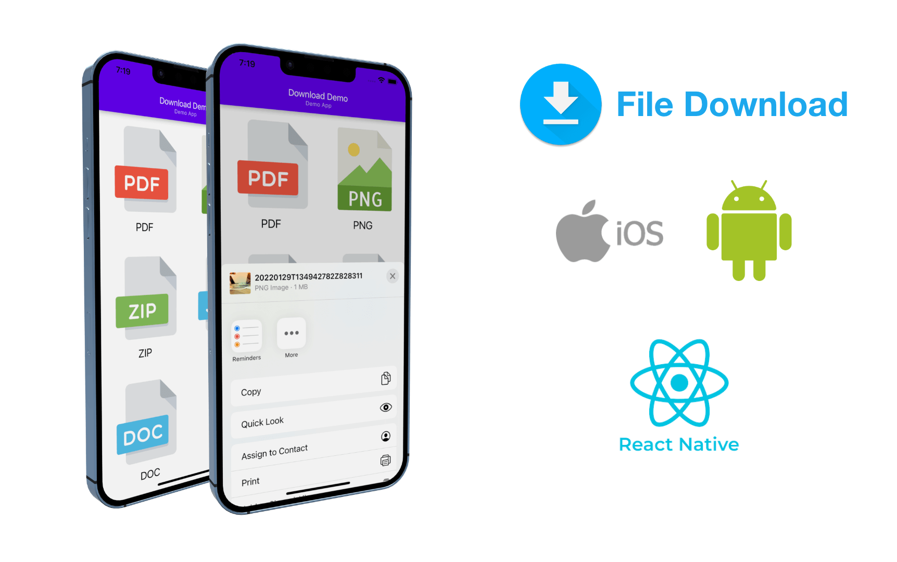

# React Native File Download 🔥

In this repo you will find quick snippet for downloading file in React Native (android & iOS)


## Installation 🔧

Install `rn-fetch-blob` in your project

### npm

```bash
  npm i rn-fetch-blob
```

### yarn

```bash
  yarn add rn-fetch-blob
```

### Installation Android

Add required permission in `AndroidManifest.xml`

```bash
<uses-permission android:name="android.permission.READ_EXTERNAL_STORAGE" />
<uses-permission android:name="android.permission.WRITE_EXTERNAL_STORAGE" />
<uses-permission android:name="android.permission.DOWNLOAD_WITHOUT_NOTIFICATION" />
```

### Installation iOS

No changes required for iOS.

## Usage 🤔

Copy `DownloadFileServices.ts` File into your project & import like below.

```javascript
// import File in your code 👇

import { DownloadFile } from "../DownloadFileServices";

function App() {
  return (
    <TouchableOpacity
      onPress={() => {
        let fileUrl = "Your File URL";
        DownloadFile(fileUrl); // Pass URL in function
      }}
    >
      <Text>Click Me</Text>
    </TouchableOpacity>
  );
}
```

## Run Demo project locally 🏃🏽‍♀️

Clone the project

```bash
  git clone https://github.com/girish54321/ReactNativeDownloadDemo.git
```

Go to the project directory

```bash
  cd ReactNativeDownloadDemo
```

Install dependencies

```bash
  yarn
```

Start the project

```bash
  yarn android_dev_debug
```

## FAQ

#### How to use `DownloadFileServices.ts` file in vanilla javascript

Just rename `DownloadFileServices.ts` to `DownloadFileServices.js` and remove `types`. 😇

## Contributing 🙏🏽

Contributions are always welcome!
